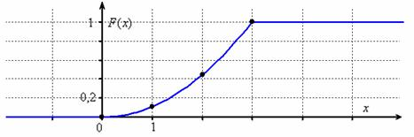
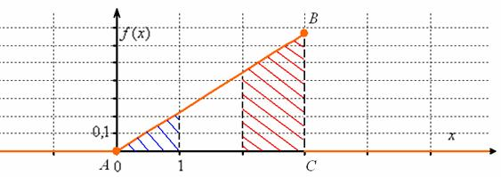

На відміну від дискретних випадкових величин, НВВ можуть приймати 
будь-які дійсні значення із деякого проміжку не нульової довжини,
що робить неможливим її представлення у вигляді таблиці (так як 
дійсни чисел нескінчено багато). Через це величину задають функціями
двух типів:

1. розподілу
1. щільності

Функція розподілу НВВ визначається так само, як і функція розподілу
ДВВ: $F(x) = P(X < x) -$ ймовірність того, що випадкова величина
прийме значення, __МЕНШЕ__, ніж змінна $x$ , яка *"проходить"* всі
значення від $-\infty$ до $\infty$. Такич чином, враховуючи всі
значення, які __ВЗАГАЛІ__ може приймати НВВ. Зі збільшенням $x$
функція розподілу *"накопичує"* (додає) ймовірності, а отже, є
незростаючою і змінюється в межах $0 \le F(x) \le 1$ . Саме тому 
її іноді називають __*інтегрально функцією розподілу*__.

Важливою особливістю є той факт, що функція розподілу __БУДЬ ЯКОЇ__
НВВ завжди і всюди непервна! Часто її можна побачити кусково заданою:
$$
F(x) = 
    \begin{cases}
        0, & \text{якщо}\ x \lt 0 \\
        \frac{x^2}{9}, & \text{якщо}\  0 \le x \le 3 \\
        1, & \text{якщо}\ x \gt 3
    \end{cases}
$$
однак у точках *"стику"* все добре:
$F(0) = \frac{0^2}{9} = 0,\ F(3) = \frac{3^2}{9} = 1$
і якщо там розрив, то ви маєте справу із відвертою помилкою!

> *P.S.: Але сам по собі непервність і нуль зліва, одиниця справа –*
*ще не означають, що перед нами функція розподілу.*

При побудові приблизного малюнку буде доречно знайти опорні точки;
у нашому прикладі зручно взяти $F(1) = \frac{1^2}{9} \approx 0.11,$
$F(2) = \frac{2^2}{9} \approx 0.44$ і плавно-плавно провести олівцем
шматок параболи $y = \frac{x^2}{9}$:

Не забуваєм, що $F(x)$ не може спадати, і якщо раптом виявиться, що
якийсь шмат графіка йде *"зверху вниз"*, то шукайте помилку або ж
може просто дрогнула рука о_О.

Тепер повернемося до сенсу функції розподілу і розглянемо пару
конкретних *"іксів"*:

$F(-1) = P(X \lt -1) = 0 \ -$ ймовірність того, що випадкова
величина $X$ прийме значення, __МЕНШЕ__, за –1;

$F(4) = P(X \lt 4) = 1 \ -$ ймовірність того, що випадкова
величина $X$ прийме значення, __МЕНШЕ__, за 4;

Ну, і очевидно, що розглядаєма випадкова величина приймає 
випадкові, наперед невідомі значення із відрізка $[0; 3]$. Якщо 
вкладати в задачу зміст, то це може бути випадкова тривалість
деякого процессу (в секундах, наприклад), або масса або розмір
випадково вибраного об'єута (наприклад, крупинки піску). І тому
подібне – прикладів багато. Конкретні задачі обов'язково будуть,
але до того залишимося на технічній стороні питання. 

Ймовірність того, що випадкова величина прийме значення із
деякого проміжку, знаходиться ще легше, ніж для дискретної 
випадкової величини. Тут немає ніякої Санта-Барбари: відрізок
чи $[0; 3]$ нам дан, полуінтервал $(a, b], [a, b)$ або інтервал
$(a, b)$, відповідні ймовірність можна обчислити за формулою:
$$
F(a) - F(b)
$$

> *P.S.: в наступних темах це буде пояснено*

Наприклад:

$P(0 \le X \le 1) = F(1) - F(0) = \frac{1^2}{9} - \frac{0^2}{9} = \frac{1}{9}$ - ймовірність того, що випадкова
величина прийме значення на відрізку $[0; 1]$; І такими самими
будуть ймовірності $P(0 \lt X \lt 1), P(0 \le X \lt 1),$
$P(0 \lt X \le 1)$.

$P(2 \le X \le 3) = F(3) - F(2)= \frac{3^2}{9} - \frac{2^2}{9} = \frac{5}{9}$ - ймовірність того, що випадкова
величина прийме значення на відрізку $[2; 3]$;

Мабуть, хтось підмітив, що на відрізках *однакової довжини*
результат отримується різним: $P(2 \le X \le 3) \ne P(0 \le X \le 1)$
. Тому відкритим залишається питання: а як оцінити цю
*"концентрацію"* ймовірностей на різних проміжках? - бо функція
розподілу $F(x)$ характеризує **накопичення** ймовірностей при
збільшенні $x$ і просто багато разів вичисляти малі проміжки:
$F(b)-F(a)$ - пуста робота.

Саме тому і існує таке поняття як __функція щільності__.

## Функція щільності

або диференціальна функція розподілу. Вона являє собою 
похідну функцію розподілу $f(x) = F'(x)$.

>*P.S.: для дискретної випадкової величини такої функції не існує*

У нашому прикладі:
$$
f(x) = F'(x) = 
\begin{cases}
    (0)', & \text{якщо}\ x \lt 0 \\
    (\frac{x^2}{9})', & \text{якщо}\  0 \le x \le 3 \\
    (1)', & \text{якщо}\ x \gt 3
\end{cases} =
\begin{cases}
    0, & \text{якщо}\ x \lt 0 \\
    \frac{2x}{9 }, & \text{якщо}\  0 \le x \le 3 \\
    0, & \text{якщо}\ x \gt 3
\end{cases}
$$
Тобто, все достатньо легко - просто беремо похідну від кожного
шматка.

Але найцікавішим є той факт, що невласний: $\int_{-\infty}^{\infty}$
$f(x)dx = 1$ - __дорівнює одиниці і строго одиниці__. Інакше перед
нами не функція щільності, і якщо така функція була знайдена як
похідна, то $F(x)$ - не є функцією розподілу.

Перевірим наші функції на коректність. Якщо випадкова величина
приймає значення із конкретного проміжку, то все зводится до
обислення визначеного інтегралу. В силу _адитивності_:
$$
\int_{-\infty}^{\infty} f(x) dx =
 \int_{-\infty}^{0} 0 \cdot dx +
 \int_{0}^{3} \frac{2x}{9} dx +
 \int_{3}^{\infty} 0 \cdot dx
$$

Абсолютно зрозуміло, що лівий і правий інтеграли рівні нулю і
нам залишилося обчислити:
$$
\frac{2}{9}\int_{0}^{3} x dx = 
\frac{2}{9} \cdot \frac{1}{2}(x^2) \vert_{0}^{3} =
\frac{1}{9}(9 - 0) = 1
$$
що потрібно і було довести.

З ймовірностної точки зору це означає, що випадкова величина $X$
точно прийме одне із значень $[0; 3]$. Геометрично це ж означає,
що площа між осями і графіком дорінює одиниці, у данному випадку
йдеться про про площу трикутника $ABC$. Сторона $AB$ є фрагментом
прямої $y = \frac{2x}{9}$ і для її побудови достатньо знайти точку
$y(3) = \frac{2 \cdot 3}{9} = \frac{2}{3} \approx 0.67$:

Тепер видно – де більша площа, там і більш ймовірні значення. Так
як функція щільності _"збирає під собою"_ ймовірності, то вона
теж невід'ємна $(f(x) \ge 0)$ і її графік не може бути нижче осі
$OX$. Також підмітимо, що ця функція розривна (подивіться на 
_"жирні"_ точки).

Тепер розберемо достатньо цікавий факт: так як чисел незлічено
багато, то ймовірність того, що випадкова величина прийме якесь
конкретне значення наближаєтся до нуля. І тому ймовірність
розраховується не для окремо взятих точек, а для цілих проміжків
(нехай навіть для дуже малих). Як ви правильно здогадалися:
$$
P(0 \le X \le 1) = 
\int_{a}^{b} f(x) dx = 
\frac{2}{9} \int_{0}^{1} x dx = 
\frac{2}{9} \cdot \frac{1}{2} (x^2) \vert_{0}^{1} = 
\frac{1}{9} (1-0) = \frac{1}{9}
$$
(синя площина) - ймовірність того, що випадкова величина прийме
значення з відрізка $[0; 1]$;
$$
P(2 \le X \le 3) = 
\frac{2}{9} \int_{2}^{3} x dx = 
\frac{2}{9} \cdot \frac{1}{2} (x^2) \vert_{2}^{3} = 
\frac{1}{9} (9-4) = \frac{5}{9}
$$
(червона площа) - ймовірність того, що випадкова величина прийме
значення з відрізка $[2; 3]$;

По тій причині, що окремо взяті значення можно не брати до уваги,
за допомогою тих же самих інтегралів можна обчислювати
і ймовірність по інтервалам / полуінтервалам, в частності:
$$
P(0 \lt X \le 1) = 
P(0 \lt X \lt 1) = 
P(0 \le X \lt 1) = 
\frac{2}{9} \int_{0}^{1} x dx =
\frac{1}{9}
$$

> *P.S.: саме тому і пояснюється пункти вище про $F(x)$*